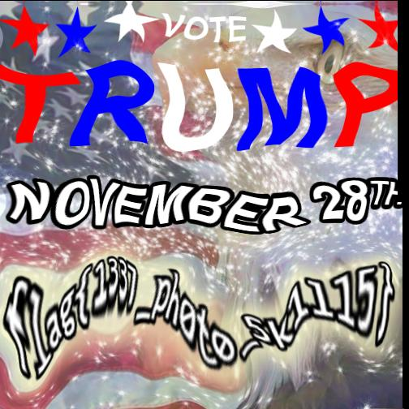

# Warp Speed - [150] Forensics

**Kevin Orr** - [USF Whitehatter's Computer Security Club](https://ctftime.org/team/315)

### Description

> Our Trump advertising campaign is incredible, it's skyrocketing! It's astronomical! Wait stop!! SLOW DOWN!!!
> 
> [warp_speed.jpg](https://s3.amazonaws.com/hackthevote/warp_speed.5978d1405660e365872cf72dddc7515603f657f12526bd61e56feacf332cccad.jpg)

### Solution

We are given the following image:

The name "Trump" is visible on the image, though the entire image seems to be askew. It appears that individual "strips" (size 504x8)
of the image have been reflowed into an image of size 1000x250. Using the python library [pillow](https://python-pillow.org/),
this image can be relowed so that each strip is directly below the one on top, and with no hoizontal shift. [`sol.py`](sol.py)
accomplishes this transformation and outputs the following image:

### Flag

`flag{1337_ph0t0_5k1lls}`
